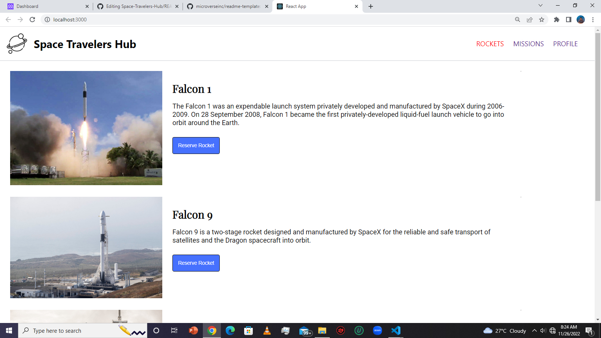

<!-- TABLE OF CONTENTS -->

# 📗 Table of Contents

- [📖 About the Project](#about-project)
  - [🛠 Built With](#built-with)
    - [Key Features](#key-features)
  - [🚀 Live Demo](#live-demo)
- [💻 Getting Started](#getting-started)
  - [Setup](#setup)
  - [Prerequisites](#prerequisites)
  - [Usage](#usage)
  - [Run tests](#run-tests)
- [👥 Authors](#authors)
- [🔭 Future Features](#future-features)
- [🤝 Contributing](#contributing)
- [⭐️ Show your support](#support)
- [🙏 Acknowledgements](#acknowledgements)
- [❓ FAQ](#faq)
- [📝 License](#license)

<!-- PROJECT DESCRIPTION -->

# 📖 [SpaceHub] 

> An application for a company that provides commercial and scientific space travel services. 

**[SpaceHub]** is a web application for a company that provides commercial and scientific space travel services. The application allow users to book rockets and join selected space missions, working with real live data from the SpaceX API.

## 🛠 Built With 
- Redux and React JS 
    { 
      components, events, states, hooks, 
      props, router, reducers and actions, API
    }
- JSX
- JavaScript
- Webpack
- GitFlow

> Describe the tech stack and include only the relevant sections that apply to your project.

  
Client

  <ul>
    <li><a href="https://reactjs.org/">React.js</a></li>
  </ul>

<!-- Features -->

### Key Features 

> Some few key features of the app.

- **[Users can reserve and unreserve Rocket space]**
- **[Users can join a space Mission from the App]**
- **[Users can view all books rockets and joined Space Mission]**

(<a href="#readme-top">back to top</a>)

<!-- LIVE DEMO -->

## 🚀 Live Demo 

>Link to live Demo 

- [Coming soon]()

(<a href="#readme-top">back to top</a>)

<!-- GETTING STARTED -->

## 💻 Getting Started 

To get a local copy up and running, follow these steps.

>clone the repo like this: 
​
  git clone https://github.com/StarMindz/Space-Travelers-Hub

>Install the dependencies using `npm install` and then run the project from the root of the folder using this command `npm run start`

### Prerequisites

In order to run this project you need:

- A Text Editor: Visual Studio Code is recommended
- A GitHub Account
- Npm installed

### Setup

- Clone this repository to your desired folder: https://github.com/StarMindz/Space-Travelers-Hub

- cd into the folder

### Usage

To run the project, execute the command "npm start" on terminal

### Run tests

To run tests, run the command "npm test"

(<a href="#readme-top">back to top</a>)

<!-- AUTHORS -->

## 👥 Authors 

> Mention all of the collaborators of this project.

👤 **Stanley Nnamani AKA StarMindz**

- GitHub: [@Starmindz](https://github.com/StarMindz)
- LinkedIn: [Stanley Nnamani](https://www.linkedin.com/in/stanley-nnamani/)

👤 **Alexandre Sales Medina Ferreira**

- GitHub: [Alexandre](https://github.com/alexmedinasf)

(<a href="#readme-top">back to top</a>)

<!-- FUTURE FEATURES -->

## 🔭 Future Features 

Some Future Features : 
- Make the site mobile responsive
- Add a Dragon section
- Add more infos to the pages like the unit cost of travel, the cost of the mission,and more infos

(<a href="#readme-top">back to top</a>)

<!-- CONTRIBUTING -->

## 🤝 Contributing 

Contributions, issues, and feature requests are welcome!

Feel free to check the [issues page](../../issues/).

(<a href="#readme-top">back to top</a>)

<!-- SUPPORT -->

## ⭐️ Show your support 

If you like this project, please give it a star and also follow me on GitHub for future projects

(<a href="#readme-top">back to top</a>)

<!-- ACKNOWLEDGEMENTS -->

## 🙏 Acknowledgments 

- I would like to thank my Partner for his contributions during the course of building this project
- Thumb ups to all the Naija Afrobeat Musicians whose beautiful music made building this project more fun

(<a href="#readme-top">back to top</a>)

<!-- LICENSE -->

## 📝 License 

This project is [MIT](./LICENSE) licensed.

_NOTE: we recommend using the [MIT license](https://choosealicense.com/licenses/mit/) - you can set it up quickly by [using templates available on GitHub](https://docs.github.com/en/communities/setting-up-your-project-for-healthy-contributions/adding-a-license-to-a-repository). You can also use [any other license](https://choosealicense.com/licenses/) if you wish._

(<a href="#readme-top">back to top</a>)

